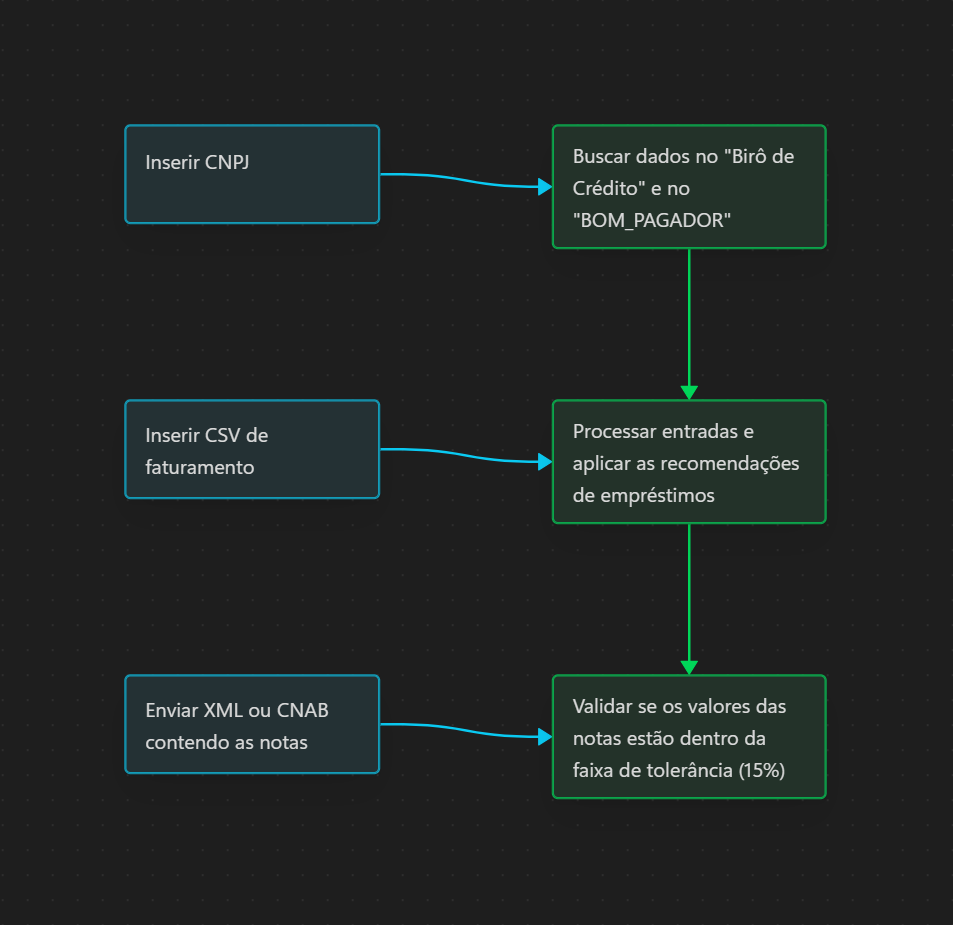

# Contexto (pessoal)

O sistema se refere a uma empresa financeira que realiza operações de empréstimo.
O mesmo deve ser capaz de buscar as informações de um cliente para verificar se ele pode ou não solicitar um empréstimo, e se pode, qual o nível de empréstimo adequado.

## Sistema de Birô de Crédito
Birô de Crédito é um sistema que verifica o score de crédito do cliente.

Através de uma pesquisa, descobri que o Birô de crédito leva em conta diversos fatores para verificar o score de crédito do cliente, como:

- Renda fixa (salário)
- Linhas de crédito ativas
- Débito atual

A solicitação se refere a uma API, mas não especifica qual, com isso, durante a fase de desenvolvimento, o sistema fará uma geração de dados fictícios para testes.
Segue um exemplo de resposta da API:

```json
{
  "cnpj": "00000000000000/0001",
  "name": "Fulano da Silva",
  "income": 4500,
  "open_credit_lines": 3,
  "current_debt": 1200,
  "delinquencies": 1,
  "payment_history": {
    "last_12_months_on_time_percent": 92
  },
  "score": 720,
  "score_scale": "0-1000",
  "generated_at": "2025-11-07T12:34:56Z"
}
```

## Sistema de FATURAMENTO_MENSAL
Faturamento Mensal será uma lista de valores/meses que será obtida de alguma forma alternativa, pois não possui API. Inicialmente será uma lista enviada por CSV,
mas precisa estar adaptado para futuras implementações de outros formatos.

Segue um exemplo de dados do CSV:
```csv
competence,value
2025-01,10000
2025-02,12000
2025-03,11000
2025-04,13000
2025-05,14000
2025-06,15000
```
## Sistema de BOM_PAGADOR
Não encontrei nada muito relevante sobre o sistema BOM_PAGADOR, provavelmente é um sistema
fictício para a implementação do sistema.

Com isso, vou tomar a liberdade de criar um sistema fictício para o mesmo, com o objetivo de testar a lógica do sistema.

O sistema retornará um JSON contendo uma lista de meses (compentências) e os valores pagos e não pagos.

Segue um exemplo de resposta do JSON:
```json
[
  {
    "competence": "2025-01",
    "paid": 10000,
    "not_paid": 0
  },
  {
    "competence": "2025-02",
    "paid": 12000,
    "not_paid": 2000
  },
  {
    "competence": "2025-03",
    "paid": 11000,
    "not_paid": 0
  }
]
```

## Faixas de Empréstimos
A documentação menciona que existem três faixas de empréstimos: **P**, **M** e **G**, com os seguintes critérios:

- **P:** score acima de **400** e faturamento mensal acima de **R$ 10.000**
- **M:** score acima de **600** e faturamento mensal acima de **R$ 100.000**
- **G:** score acima de **800** e faturamento mensal acima de **R$ 1.000.000**

Além disso, o resultado do sistema **BOM_PAGADOR** deve ser considerado:

- Se o percentual de dívidas pagas for **inferior a 50%**, o cliente é **recusado** em qualquer operação.
- Se o percentual for **igual ou superior a 70%**, o cliente é **aprovado**.
- Se o percentual for **igual ou superior a 90%**, ele é **elegível para empréstimos de nível superior**.

**OBS:** existe uma lacuna na documentação sobre o resultado do sistema BOM_PAGADOR, caso o percentual seja entre 50% e 70%, vou propor uma lógica de análise manual, considerando o score do cliente e o faturamento mensal.

## Arquivos de entrada
Endendo que o sistema deve ser capaz de receber arquivos de entrada em diferentes formatos (XML e CNAB).

No caso do XML devo extrair a chave da nota fiscal (NF) da tag <chave>.

No caso do CNAB devo extrair a chave da nota fiscal (NF) entre os caracteres **20** e **64**.

Ambos terão multiplas notas fiscais, e o sistema deve ser capaz de processar todas as notas fiscais de forma independente.

# Levantamento de requisitos

## Funcionais
- O sistema deve ser capaz de buscar as informações de um cliente pelos sistemas de Birô de Crédito e BOM_PAGADOR pelo CNPJ;
- O sistema deve ser capaz de receber os dados do FATURAMENTO_MENSAL através de um CSV;
- O sistema deve ser capaz de processar as notas fiscais de entrada (XML e CNAB);
- O sistema deve ser capaz de retornar um JSON contendo as informações do cliente, o resultado da análise e o nível de empréstimo recomendado;

## Não funcionais
- O sistema deve armazenar as sessões de clientes em tokens JWT;
- O sistema deve ser capaz de ser executado em ambiente de container;

## Fluxo de execução simplificado


